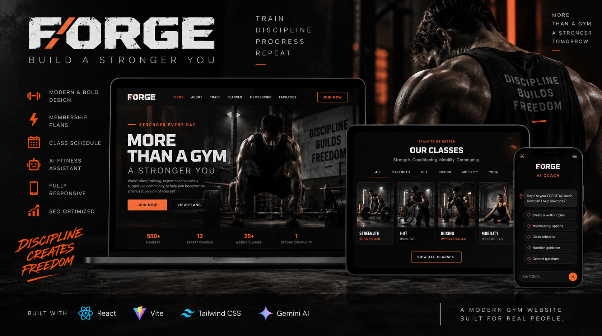
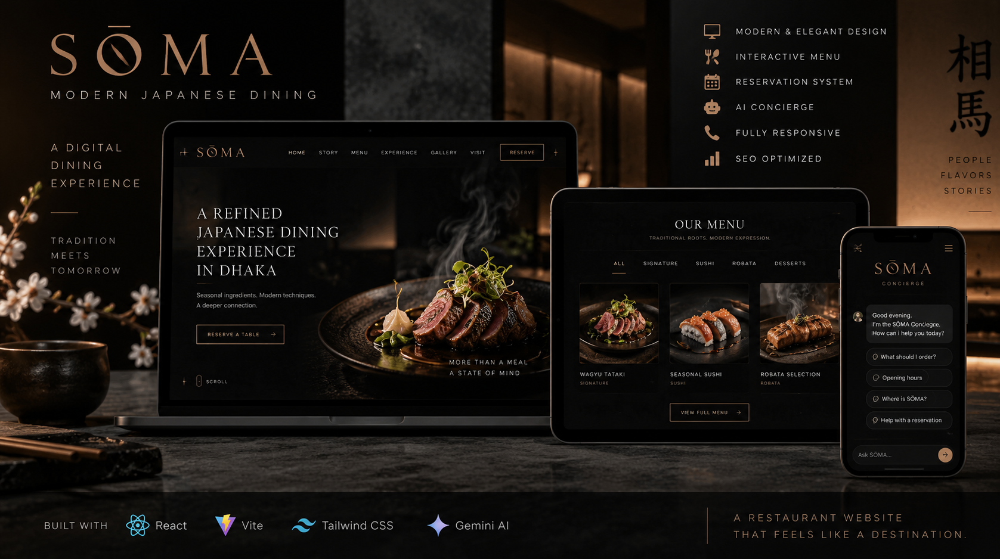
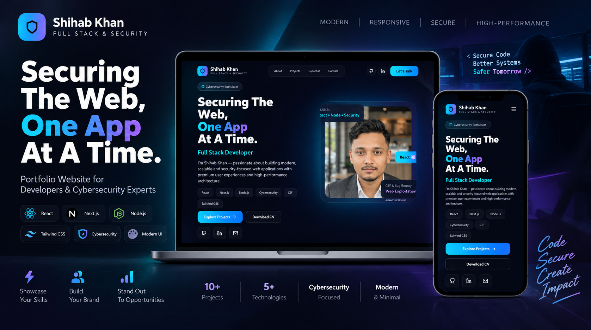

 

 

## 👋 About Me

I'm **Shihab Uddin Khan**, a web developer from **Bangladesh** who builds modern, responsive web applications with **React, JavaScript, Node.js and Express.js**.

I'm also a **cybersecurity enthusiast** — I study networking, web/API security and secure development practices, then apply what I learn to the apps I build. My goal is to become a developer who understands both **how software is built and how it can be attacked**, so I can write better, more secure code.

| | |
|---|---|
| 🧑‍💻 **Role** | Web Developer |
| 🎯 **Focus** | Web Development + Cybersecurity |
| 📍 **Location** | Bangladesh |
| 🎓 **Education** | Bangladesh University of Business and Technology |

## 🛠️ What I Do

<table width="100%">
<tr>
<td width="33%" valign="top" align="center">

### 🎨 Web Development
Building responsive, modern websites and web apps.

`React` `JavaScript` `HTML` `CSS`
`Vite` `Responsive UI` `REST APIs`

</td>
<td width="33%" valign="top" align="center">

### ⚙️ Backend Development
Learning and building server-side apps and APIs.

`Node.js` `Express.js` `Java`
`Spring Boot` `MySQL` `MongoDB`

</td>
<td width="33%" valign="top" align="center">

### 🔐 Cybersecurity
Applying practical security techniques while building.

`Web Security` `API Security` `Auth`
`Access Control` `Secure Coding`

</td>
</tr>
</table>

## 🚀 Selected Work

Real projects. Real deployments. Built to learn, experiment and improve.

<table width="100%">
<tr>
<td width="50%" valign="top">

**Medora Health**
A modern healthcare website with an AI-focused concept and responsive UX.

`Healthcare` `AI` `React` `Responsive UI`

</td>
<td width="50%" valign="top">

**Forge Fitness**
A modern gym and fitness website with a strong visual interface.

`Fitness` `Frontend` `Responsive Design` `UI/UX`

</td>
</tr>
<tr>
<td width="50%" valign="top">

**SŌMA**
A modern Japanese dining website focused on visual presentation and UX.

`Restaurant` `UI/UX` `React` `Responsive Design`

</td>
<td width="50%" valign="top">

**Personal Portfolio**
My portfolio for presenting projects, skills and dev journey.

`Portfolio` `React` `Vite` `JavaScript`

</td>
</tr>
</table>

## 🛡️ Security Focus

Cybersecurity is becoming a core part of how I approach development. I'm currently learning how vulnerabilities occur in web apps, APIs and networks, and how developers can reduce those risks.

<table width="100%">
<tr>
<td width="25%" align="center">

**Web Security**
Authentication
Authorization
Access Control
Input Validation
Secure Sessions

</td>
<td width="25%" align="center">

**API Security**
Endpoint Security
Input Validation
Rate Limiting
Authentication
Secure API Design

</td>
<td width="25%" align="center">

**Networking**
TCP/IP
HTTP / HTTPS
DNS
Network Protocols
Linux Networking

</td>
<td width="25%" align="center">

**Security Testing**
Vulnerability Testing
Security Analysis
Linux Tools
Web Testing
Secure Development

</td>
</tr>
</table>

**Security mindset**

`Understand the application` → `Identify the attack surface` → `Understand weaknesses` → `Apply security controls` → `Test the application` → `Improve the implementation`

## 💻 Tech Stack

**Languages**

**Frontend**

**Backend & Databases**

**Tools & Environment**

## 📚 Currently Learning

<table width="100%">
<tr>
<td width="33%" align="center">

**🐍 Python**
Backend development, automation and security-related projects.

</td>
<td width="33%" align="center">

**🍃 Spring Boot**
Java backend development, REST APIs and application architecture.

</td>
<td width="33%" align="center">

**🔒 Cybersecurity**
Networking, web security, API security and secure development.

</td>
</tr>
</table>

## 🧭 Development Philosophy

`Build` → `Test` → `Secure` → `Improve` → `Repeat`

I believe security should be considered *during* development, not after. As I learn new security techniques, I apply them to the projects I build — so I can understand both the development and security sides of modern web applications.

## 📊 GitHub Statistics

  

## 📫 Connect With Me

  

  

### Build · Secure · Learn · Improve

